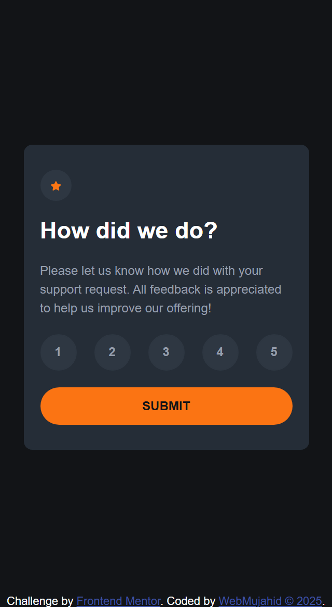

Here is your `README.md` written in **Frontend Mentor style**, using the provided template and customized to fit your **Interactive Rating Component** project:

---

````markdown
# Frontend Mentor - Interactive rating component solution

This is a solution to the [Interactive rating component challenge on Frontend Mentor](https://www.frontendmentor.io/challenges/interactive-rating-component-koxpeBUmI). Frontend Mentor challenges help you improve your coding skills by building realistic projects.

## Table of contents

- [Overview](#overview)
  - [The challenge](#the-challenge)
  - [Screenshot](#screenshot)
  - [Links](#links)
- [My process](#my-process)
  - [Built with](#built-with)
  - [What I learned](#what-i-learned)
  - [Continued development](#continued-development)
  - [Useful resources](#useful-resources)
- [Author](#author)
- [Acknowledgments](#acknowledgments)

## Overview

### The challenge

Users should be able to:

- View the optimal layout for the app depending on their device's screen size
- See hover states for all interactive elements on the page
- Select and submit a number rating
- See the "Thank you" card state after submitting a rating

### Screenshot



### Links

- Solution URL: [Githup](https://github.com/Abdulgafar-Riro/interactive-rating-component-main)
- Live Site URL: [Netlify](https://webmujahid-interactive-rating.netlify.app/)

## My process

### Built with

- Semantic HTML5 markup
- CSS custom properties (variables)
- Flexbox
- Mobile-first workflow
- Vanilla JavaScript (DOM manipulation)
- SCSS (with mixins and nesting)
- [Google Fonts - Overpass](https://fonts.google.com/specimen/Overpass)

### What I learned

This project helped me strengthen my understanding of accessible UI interactions and JavaScript event handling. I also improved at managing component states with DOM updates. Here’s a JavaScript snippet that dynamically updates the UI based on the selected rating:

```js
ratingButtons.forEach((button) => {
  button.addEventListener("click", () => {
    ratingButtons.forEach((btn) => btn.classList.remove("active"));
    button.classList.add("active");
    selectedRating = button.textContent;
  });
});
```
````

And this simple logic handles form submission and thank-you message display:

```js
submitButton.addEventListener("click", () => {
  if (!selectedRating) {
    alert("Please select a rating before submitting.");
    return;
  }
  ratingContainer.style.display = "none";
  messageSection.style.display = "block";
  selectedRatingText.textContent = `You selected ${selectedRating} out of 5`;
});
```

### Continued development

In future projects, I’d like to:

- Improve keyboard accessibility by using `<fieldset>` and native `<input type="radio">` for rating.
- Add ARIA labels and transitions for smoother accessibility experience.
- Refactor my SCSS codebase into reusable components with BEM naming.

### Useful resources

- [MDN Web Docs - ARIA Roles](https://developer.mozilla.org/en-US/docs/Web/Accessibility/ARIA/Roles) - Great resource for understanding ARIA roles and their proper usage.
- [Kevin Powell YouTube Channel](https://www.youtube.com/c/KevinPowell) - His SCSS and CSS tutorials really helped structure the layout and animations.
- [CSS Tricks: Complete Guide to Flexbox](https://css-tricks.com/snippets/css/a-guide-to-flexbox/) - A go-to guide for flexbox layout.

## Author

- Website - [WebMujahid](https://your-site.com)
- Frontend Mentor - [@webmujahid](https://www.frontendmentor.io/profile/webmujahid)
- Twitter - [@webmujahid](https://twitter.com/webmujahid)

## Acknowledgments

Thanks to the Frontend Mentor community for always inspiring and motivating developers to level up their frontend skills.
